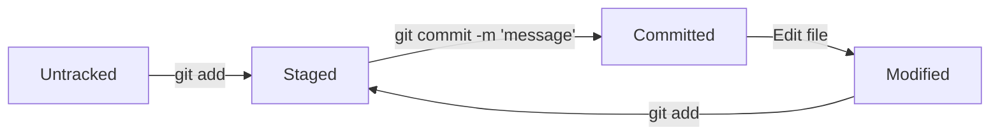

HEAD -- это голова.
Коммит -- это всему голова.
Статусы файлов:



# 📘 Git Tips & Best Practices

## 📌 Git Commit Messages

Well-written commit messages make your project easier to maintain and collaborate on. They help you (and others) understand *what* changed and *why* — without having to dig into the code.

### ✅ Guidelines for a Good Commit Message

* Keep it short (ideally **≤ 72 characters**)
* Make it informative — describe what changed, where, and why
* Avoid vague messages like `fixes`, `updates`, or `misc`

#### 💡 Examples

| Good                                    | Bad             |
| --------------------------------------- | --------------- |
| `Fix typo in homepage title (Croatian)` | `Some fixes`    |
| `Optimize image loading in gallery`     | `updated stuff` |

---

### 🛠️ Common Commit Message Styles

#### 🔹 Corporate (Jira-style)

Prefix the message with a task ID (e.g., from Jira):

```bash
LGS-239: Add Easter egg list to admin panel
```

#### 🔹 Conventional Commits

Use `type: message` format. Common types include:

* `feat` – a new feature
* `fix` – a bug fix

```bash
feat: add weekly revenue report
fix: handle empty fields in form
```

#### 🔹 GitHub Issue Reference

Link to issues directly in the message using `#issueNumber`:

```bash
Fix #42: correct broken chart on dashboard
```

---

### 🌍 Language Tips

* **Russian**: use the **infinitive** (e.g. `Добавить`, `Исправить`)
* **English**: use the **imperative** (e.g. `Add`, `Fix`, `Update`)

---

## 🔍 Git File Status & `git status`

Understanding file states is crucial for using Git effectively. A file in Git can be in one of several states:

* **Untracked** – newly created, not yet staged or committed
* **Tracked** – already committed or staged
* **Staged** – added to the staging area (via `git add`), ready for commit
* **Modified** – changed after last commit or staging

### 🔄 File Lifecycle in Git

```text
untracked → staged → committed → modified → staged → committed → ...
```

### 🧪 What `git status` Shows

* **Staged** → `Changes to be committed`
* **Modified** → `Changes not staged for commit`
* **Untracked** → `Untracked files`

> Tip: If you edit a file after staging it, run `git add` again to stage the updated version.

---

## 🔐 Git Commit Internals

Behind the scenes, Git relies on hashes and pointers to track commits and changes.

* Each commit is identified by a **40-character SHA-1 hash**
* The same content always produces the same hash (deterministic)
* Git stores all commit data (including hashes) in the hidden `.git` folder
* Use `git log` to view commit history
* Use `git log --oneline` for a concise version (with shortened hashes)

### 🧠 Understanding `HEAD`

* `HEAD` is a special pointer to the **latest commit** on your current branch
* You can use `HEAD` in place of a full commit hash in most Git commands

### 👨‍💻 Historical Note

Git was created by **Linus Torvalds** in **April 2005** to manage the Linux kernel source code.


# GIT CHEAT SHEET


Git is the free and open source distributed version control system that's responsible for everything GitHub
related that happens locally on your computer. This cheat sheet features the most important and commonly
used Git commands for easy reference.


## INSTALLATION & GUIS


With platform specific installers for Git, GitHub also provides the
ease of staying up-to-date with the latest releases of the command
line tool while providing a graphical user interface for day-to-day
interaction, review, and repository synchronization.


**GitHub for Windows**  
htps://windows.github.com


**GitHub for Mac**  
htps://mac.github.com


For Linux and Solaris platforms, the latest release is available on
the official Git web site.


**Git for All Platforms**  
htp://git-scm.com

## SETUP


Configuring user information used across all local repositories
```
git config --global user.name “[firstname lastname]”
set a name that is identifiable for credit when review version history

git config --global user.email “[valid-email]”
set an email address that will be associated with each history marker

git config --global color.ui auto
set automatic command line coloring for Git for easy reviewing
```

## SETUP & INIT


Configuring user information, initializing and cloning repositories
```
git init
initialize an existing directory as a Git repository

git clone [url]
retrieve an entire repository from a hosted location via URL
```

## STAGE & SNAPSHOT


Working with snapshots and the Git staging area
```
git status
show modified files in working directory, staged for your next commit

git add [file]
add a file as it looks now to your next commit (stage)

git reset [file]
unstage a file while retaining the changes in working directory

git diff
diff of what is changed but not staged

git diff --staged
diff of what is staged but not yet commited

git commit -m “[descriptive message]”
commit your staged content as a new commit snapshot
```

## BRANCH & MERGE


Isolating work in branches, changing context, and integrating changes
```
git branch
list your branches. a * will appear next to the currently active branch

git branch [branch-name]
create a new branch at the current commit

git checkout
switch to another branch and check it out into your working directory

git merge [branch]
merge the specified branch’s history into the current one

git log
show all commits in the current branch’s history
```

## INSPECT & COMPARE


Examining logs, diffs and object information
```
git log
show the commit history for the currently active branch

git log branchB..branchA
show the commits on branchA that are not on branch

git log --follow [file]
show the commits that changed file, even across renames

git diff branchB...branchA
show the diff of what is in branchA that is not in branch

git show [SHA]
show any object in Git in human-readable format
```

## TRACKING PATH CHANGES


Versioning file removes and path changes
```
git rm [file]
delete the file from project and stage the removal for commit

git mv [existing-path] [new-path]
change an existing file path and stage the move

git log --stat -M
show all commit logs with indication of any paths that moved
```

## SHARE & UPDATE


Retrieving updates from another repository and updating local repos
```
git remote add [alias] [url]
add a git URL as an alias

git fetch [alias]
fetch down all the branches from that Git remote

git merge [alias]/[branch]
merge a remote branch into your current branch to bring it up to date

git push [alias] [branch]
Transmit local branch commits to the remote repository branch

git pull
fetch and merge any commits from the tracking remote branch
```